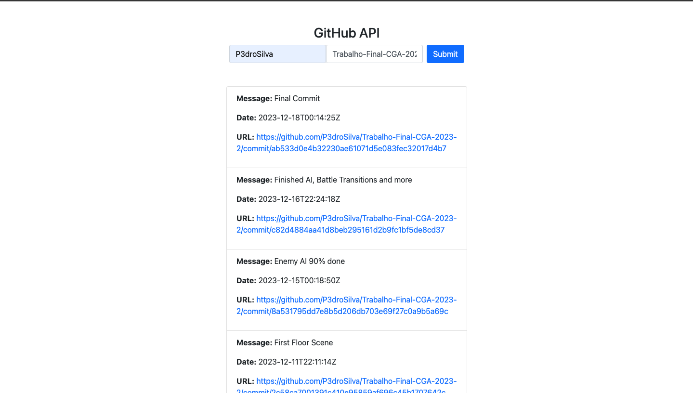

# Projeto2a: GitHub API e DOM Manipulation

.

#### Deploy

http://www-usr.inf.ufsm.br/~acneto/public_html

#### Desenvolvedores

- Pedro Henrique da Silva Hinerasky
- Alfredo Cossetin Neto

#### Ambiente de desenvolvimento

- VS Code

#### Créditos

- Não utilizamos nenhum tutorial ou ajuda

#### Bastidores

- Buscamos modificar o código distrubído a fim de buscar apenas os commits de um repositório de um usuário. O processo ocorreu tranquilamente, após estudarmos como funcionam os links de acesso de repositórios e commits. Único problema ocorreu ao final, em que a API parou de responder, devido ao grande número de acessos de todas as duplas.

---
Projeto entregue para a disciplina de [Desenvolvimento de Software para a Web](http://github.com/andreainfufsm/elc1090-2023a) em 2023a
